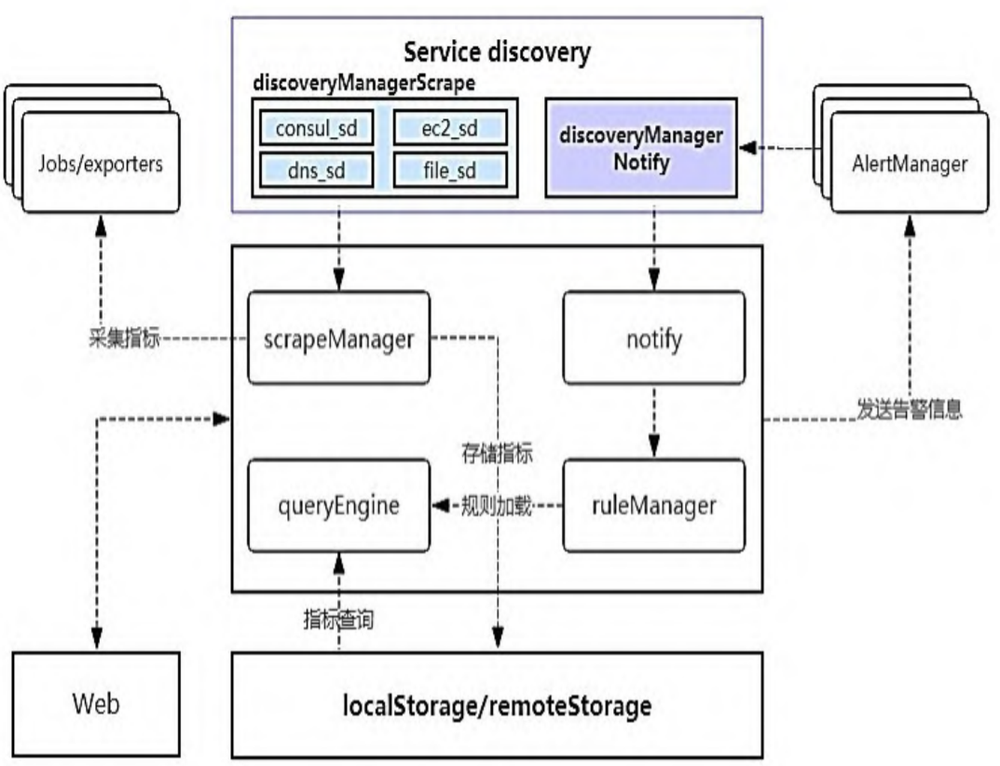
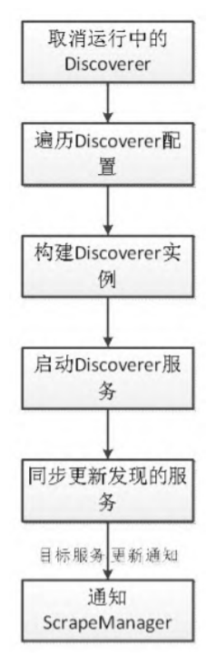
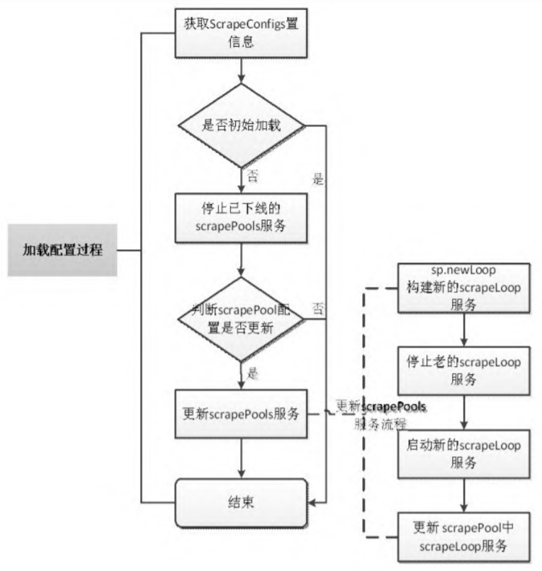
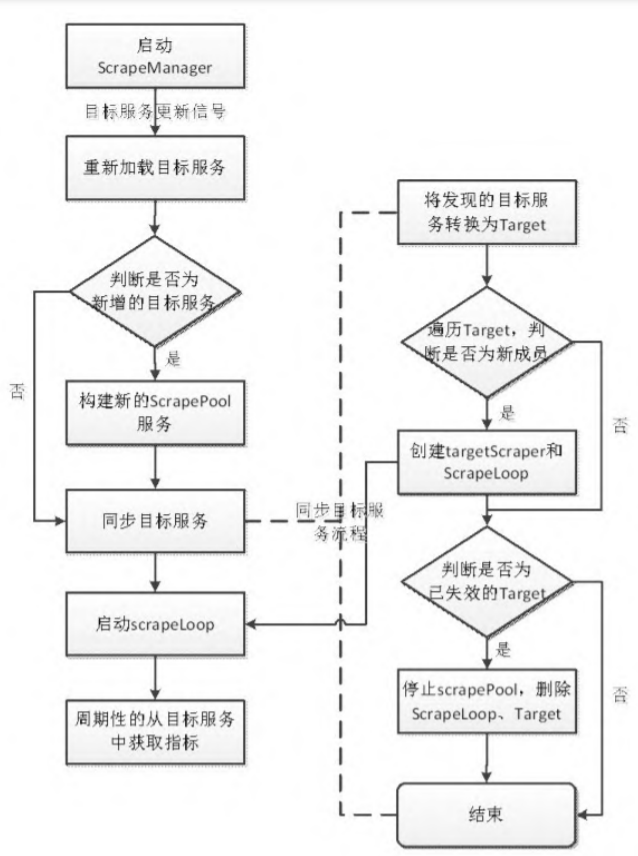
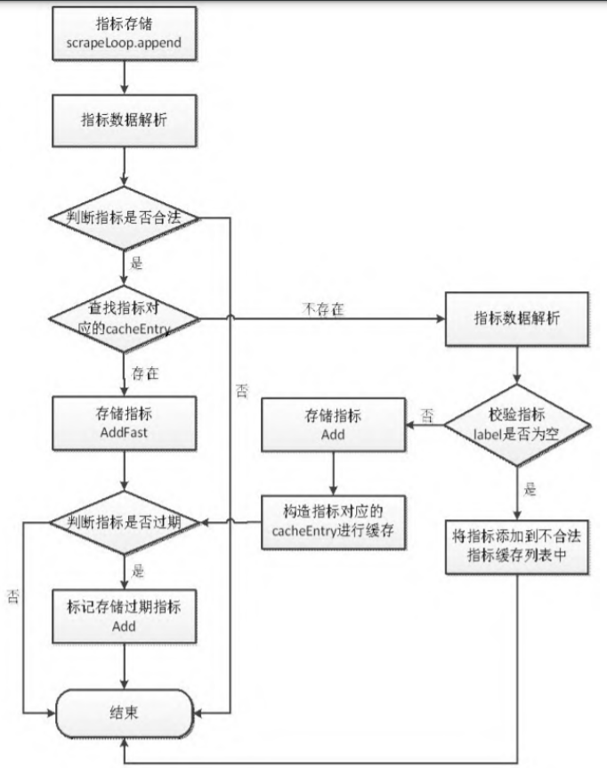

# Prometheus源码分析

Source Code From
https://github.com/prometheus/prometheus/archive/refs/tags/v2.24.0.zip

-   [Prometheus源码分析](#prometheus源码分析)
    -   [目录](#目录)
    -   [源码目录结构说明](#源码目录结构说明)
    -   [Prometheus的初始化](#prometheus的初始化)
        -   [初始化服务组件](#初始化服务组件)
            -   [存储组件](#存储组件)
            -   [notifier组件](#notifier组件)
            -   [discoveryManagerScrape组件](#discoverymanagerscrape组件)
            -   [discoveryManagerNotify组件](#discoverymanagernotify组件)
            -   [scrapeManager组件](#scrapemanager组件)
            -   [queryEngine组件](#queryengine组件)
            -   [ruleManager组件](#rulemanager组件)
        -   [web组件](#web组件)
        -   [组件配置管理](#组件配置管理)
        -   [启动服务组件](#启动服务组件)
    -   [数据采集](#数据采集)
        -   [服务发现](#服务发现)
        -   [指标采集](#指标采集)
        -   [存储指标](#存储指标)
    
## 源码目录结构说明
| 源码目录 | 说明 | 备注 |
| :----: | :---- | :---- |
| cmd/ | prometheus目录中的main.go是整个程序的入口，promtool目录是规则校验工具promtool的源码目录 | |
| config/ | 用于管理YAML配置文件的加载、解析及常用配置结构的定义 | |
| console_libraries/ | 目录中的menu.lib和prom.lib是prometheus内置的基本界面组件，在自定义模板中可直接使用 | |
| consoles/和template/ | 用于管理prometheus控制台，还可以通过自定义模板增加外部的访问服务 | |
| discovery/ | prometheus的服务发现模块，用于发现scrape服务和告警服务 | |
| notifier/ | prometheus的通知管理模块，规则运算产生告警后将告警信息通过notifier发送给发现的告警服务 | |
| pkg/| prometheus的基础元素（如维度、时间戳、字节池等） | |
| prompb/ | 定义了三种协议，分别为远程存储协议、rpc通信协议和types协议 | |
| promql/ | 目录为规则计算的具体实现，根据载入的规则进行规则计算，并生成告警指标 | |
| rules/ |  prometheus的规则管理模块，用于实现规则加载、计算调度和告警信息的回调 | |
| scrape/ | 负责监控对象的指标拉取 | |
| scripts/ | 跟踪生成protobuf代码所需工具的依赖关系 | |
| storage/ | prometheus的指标存储模块，有remote（远程存储）、tsdb（本地存储）两种类型 | |
| tsdb/ | 本地存储模块 | |
| util/ | 工具类 | |
| vendor/| 第三方依赖包 | |
| web/| prometheus Web服务模块 | |

## Prometheus的初始化
### 初始化服务组件
#### 存储组件
Prometheus 对指标的存储采用的是时序数据库，localStorage 与 remoteStorage 在初始化时需要使用相同的时间基线（localStorage.StartTime）存储指标。

指标的存储周期默认为15d，可通过 Prometheus 命令行参数--storage.tsdb.retention=15d进行个性化设置。

cmd/prometheus/main.go:375

#### notifier组件
notifier组件用于告警通知，在完成初始化后，notifier组件内部会构建一个告警通知队列，队列的大小由命令行参数 --alertmanager.notification-queue-capacity确定，默认值为10000，且告警信息通过sendAlerts方法发送给AlertManager。

cmd/prometheus/main.go:389

#### discoveryManagerScrape组件
discoveryManagerScrape 组件用于发现指标采集服务，对应prometheus.yml配置文件中scrape_configs节点下的各种指标采集器（static_config、kubernetes_sd_config、openstack_sd_config、consul_sd_config 等）

cmd/prometheus/main.go:393

#### discoveryManagerNotify组件
discoveryManagerNotify组件的构建与 discoveryManagerScrape 组件的构建方式一样，不同的是前者服务于 notify，后者服务于scrape

cmd/prometheus/main.go:397

#### scrapeManager组件
scrapeManager组件用于管理对指标的采集，并将所采集的指标存储到fanoutStorage中。

scrapeManager组件的采集周期在prometheus.yml配置文件中由 global节点下的 scrape_interval 指 定，且各个job_name可以在scrape_configs下进行个性化设置，设置符合自身应用场景的scrape_interval。

prometheus.yml 配置文件中global下的scrape_interval作用域为全局，所有job_name共用。在scrape_configs下job_name中所配置的 scrape_interval作用域仅限所描述的job_name。

cmd/prometheus/main.go:400

#### queryEngine组件
queryEngine 组件为规则查询计算引擎，在初始化时会对查询超时时间（cfg.query Timeout）和并发查询个数（cfg.queryEngine.MaxConcurrentQueries）进行设置。

cmd/prometheus/main.go:413

#### ruleManager组件
ruleManager组件整合了 fanoutStorage组件、queryEngine组件和 notifier组件，完成了从规则运算到告警发送的流程。

规则运算周期在 prometheus.yml 配置文件中由 global 节点下的 evaluation_interval 指定，各个job_name还可以在scrape_configs下进行个性化设置，设置符合自身应用场景的规则运算周期（evaluation_interval）。

在 global 下配置的 evaluation_interval 作用域为全局，在scrape_configs下job_name所配置的scrape_interval作用域仅限所描述的job_name。

cmd/prometheus/main.go:416

### web组件
在 Web 服务中引用了 localStorage 组件、fanoutStorage组件、scrapeManager组件、ruleManager组件和notifier组件，并对外提供了HTTP访问服务。

cmd/prometheus/main.go:446

### 组件配置管理
组件配置管理就是将相关组件的配置加载过程统一为ApplyConfig 方法，并存储到reloaders中进行统一调用。

在remoteStorage、webHandler、notifier和scrapeManager组件中对ApplyConfig方法有直接的实现。

discovery/manager.go:158

cmd/prometheus/main.go:507,520

rules/manager.go:940

cmd/prometheus/main.go:529

### 启动服务组件
vendor/github.com/oklog/run/group.go:24

cmd/prometheus/main.go:620,841

vendor/github.com/oklog/run/group.go:32

Prometheus各服务组件的启动流程由10次group的Add方法调用链构成，具体内容如下：

◎ 第1个Add用于控制 Prometheus程序的退出。当满足以下任一条件时将退出：Prometheus接收到 SIGTERM系统信号；Prometheus程序设置了--web.enable-lifecycle参数来启动且收到curl -X POST localhost:9090/-/quit请求。

◎ 第2个Add用于启动discoveryManagerScrape服务。

◎ 第3个Add用于启动discoveryManagerNotify服务。

◎ 第4个Add根据在第2个 Add中 discoveryManagerScrape发现的 scrape服务启动且采集指标数据。

◎ 第5个Add用于系统配置的热加载，reloadConfig方法用于加载系统配置文件，且当 Prometheus 进程收到 SIGHUP 信号或者收到curl -X POST localhost:9090/-/reload请求（Prometheus启动参数--web.enable-lifecycle）时，reloadConfig方法会被调用。

◎ 第6个Add用于初始化系统配置的参数和设置Web可用的服务状态。

◎ 第7个Add用于启动规则管理组件ruleManager。

◎ 第8个Add启动存储组件，Prometheus 指标的存储采用的是时序数据库，所以在初始化启动时会设置开始时间和储存路径。

◎ 第9个Add用于启动Web服务组件。

◎ 第10个Add根据在第3个Add中discoveryManagerNotify发现的AlertManager启动notifier组件服务。

## 数据采集
### 服务发现

discovery/discovery.go:35

discovery/targetgroup/targetgroup.go:25

discovery/manager.go:117,311,201

discovery/refresh/refresh.go:74

discovery/manager.go:216,274,240,292

### 指标采集
指标采集是指从发现的服务中定时获取指标数据。Prometheus 在启动过程中会完成对ScrapeManager的初始化，初始化过程包括构造ScrapeManager实例、加载配置和启动 ScrapeManager实例这三个步骤。ScrapeManager负责维护 scrapePool，并且管理scrape组件的生命周期。

scrape/manager.go:123,104

ScrapeManager 的配置加载，是根据 prometheus.yml 中的scrape_configs (ScrapeConfig)配置项，对scrape服务进行配置更新处理，调用方法为 ApplyConfig，其内部实现分初次加载和配置更新动态加载这两种场景。

config/config.go:319

scrape/manager.go:243

sp.reload方法将重新配置scrapePool，其流程分为以下三步：

◎ 构建新的scrapeLoop服务；

◎ 停止线上所对应的scrapeLoop服务；

◎ 启动新的scrapeLoop服务。

scrape/scrape.go:332

scrapeLoop对 scrape进行了一层封装，在控制指标采集的同时，会将采集到的数据存储到存储管理器中。

ScrapeManager通过调用retrieval下的Manager.Run方法完成启动，其参数为根据 prometheus.yml 配置发现的目标服务（targetgroup.Group），由discovery模块中的Manager.SyncCh方法负责与ScrapeManager通信（服务上线、下线）。

当syncCh发生变化时，将触发ScrapeManager中的reload方法，在reload 方法中会遍历目标服务（targetgroup.Group），根据tsetName （对应 prometheus.yml 配置文件中的jobName）从scrapePools中查找scrapePool，如果找不到，则新建一个scrapePool，使每个job都有一个对应的scrapePool。

最后调用 sp.Sync(tgroup)来更新 scrapePool的信息，通过sync方法可以得出哪些target仍然是活跃的，哪些target已经失效了。

scrape/manager.go:139,158,177

sp.Sync 方法主要用于将 tgroup（targetgroup.Group 类型）转换为 Target，再调用scrapePool .sync方法同步scrape服务。

ScrapePool主要管理目标服务和scrapeLoop。

scrape/scrape.go::418

scrapePool.sync方法将输入参数targets与原有的targets列表（sp.targets）进行对比，如果有新的 target 加入，就创建新的targetScraper 和 scrapeLoop，并且启动新的 scrapeLoop；如果发现已经失效的 target，就会停止 scrapeLoop 服务并删除对应的target和scrapeLoop。

scrape/scrape.go:457

scrapeLoop是scrape的直接管理者，每个scrapeLoop都通过一个goroutine来运行，scrapeLoop控制scrape进行指标的拉取。

scrape/scrape.go:1018,1088

◎ 在 scrapeAndReport 方法中调用 sl.scraper.scrape 进行指标采集，并将采集到的指标通过sl.append方法进行存储；

◎ 在 scrape 过程中为了提高性能，使用 sync.Pool 机制来复用对象，在每次scrape后都会向Pool申请和scrape结果同样大小的byte slice，并将其添加到sl.buffers中，以供下一次获取的指标使用。

### 存储指标
Prometheus在通过scrape获取指标后，调用scrapeLoop.append方法将指标存储到fanoutStorage 组件中，但在scrape与fanoutStorage之间加了一层 scrapeCache，用于指标合法性校验。

在scrapeCache中缓存了两种不合法的指标：

◎ 指标纬度为空，这部分指标被称为无效指标。

◎ 在连续两次指标存储中，第1次存储的不带时间戳指标在第2次存储的不带时间戳指标中不存在，这部分指标被称为过期指标。

scrape/scrape.go:739,777,789,847,859,867,873,882,887

在 scrapeLoop.append 方法中，先获取指标存储器（app）和指解析器（p），从p中循环获取指标（met）并通过sl.cache.getDropped方法判断met是否为不合法指标，如果为不合法指标就丢弃，然后根据met在sl.cache.get(entries)中查找cacheEntry。

如果查找到对应的cacheEntry，就调用app.AddFast方法进行指标存储。

如果没有查找到对应的 cacheEntry，就调用 app.Add 方法进行指标存储。在进行指标存储操作前，会根据在 prometheus.yml 中配置的 HonorLabels、MetricRelabelConfigs 规则，对指标的 label进行重置，然后对指标的合法性进行校验，校验方式为判断指标的label是否为空。如果校验结果不合法，就将 met添加到scrapeCache的dropped列表中，以供下一次指标存储前匹配校验，最后将指标通过sl.cache.addRef方法缓存到scrapeCache的entries列表。sl.cache.addRef方法主要用于将指标信息构造为cacheEntry结构。

被存储的指标还分为自带时间戳与不带时间戳两种。自带时间戳的指标的存储按照上述流程处理。而不带时间戳的指标的存储，则将系统的当前时间作为指标的时间，并且会将指标通过sl.cache.trackStaleness方法缓存到scrapeCache的seriesCur列表中。

对过期指标的处理通过调用 sl.cache.forEachStale方法完成。在 forEachStale方法中先遍历 scrapeCache 结构中的 seriesPrev，并判断 seriesPrev 中的指标是否存在于seriesCur中，如果不存在，就表示该指标为过期指标，并将过期指标的值设置为StaleNaN 后进行存储，如果存在就不做处理。在 seriesPrev 中缓存了上次存储的指标中不带时间戳的指标。

scrape/scrape.go:1302

