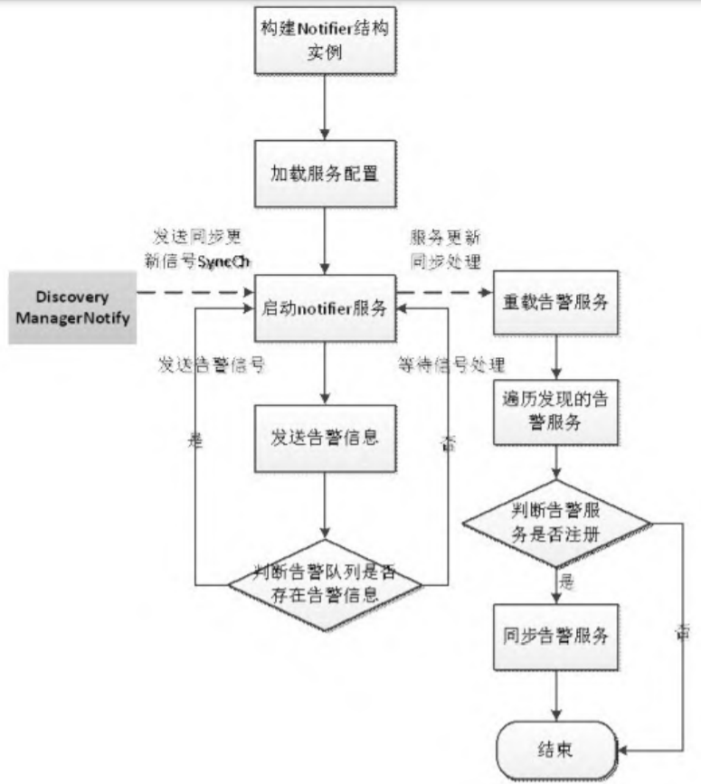

# Prometheus源码分析

Source Code From
https://github.com/prometheus/prometheus/archive/refs/tags/v2.24.0.zip

-   [Prometheus源码分析](#prometheus源码分析)
    -   [源码目录结构说明](#源码目录结构说明)
    -   [Prometheus的初始化](#prometheus的初始化)
        -   [初始化服务组件](#初始化服务组件)
            -   [存储组件](#存储组件)
            -   [notifier组件](#notifier组件)
            -   [discoveryManagerScrape组件](#discoverymanagerscrape组件)
            -   [discoveryManagerNotify组件](#discoverymanagernotify组件)
            -   [scrapeManager组件](#scrapemanager组件)
            -   [queryEngine组件](#queryengine组件)
            -   [ruleManager组件](#rulemanager组件)
        -   [web组件](#web组件)
        -   [组件配置管理](#组件配置管理)
        -   [启动服务组件](#启动服务组件)
    -   [数据采集](#数据采集)
        -   [服务发现](#服务发现)
        -   [指标采集](#指标采集)
        -   [存储指标](#存储指标)
    -   [通知管理](#通知管理)
        -   [启动notifier服务](#启动notifier服务)
            -   [构建notifier结构实例](#构建notifier结构实例)
            -   [加载服务配置](#加载服务配置)
            -   [启动notifier](#启动notifier)
        -   [注册notifier](#注册notifier)
    -   [规则管理](#规则管理)
        -   [规则调度](#规则调度)
        -   [查询引擎](#查询引擎)
            -   [源码结构（promql/）](#源码结构promql)
            -   [BinaryExpr运算](#binaryexpr运算)
            -   [时间窗口规则运算](#时间窗口规则运算)
            -   [规则计算与指标查询](#规则计算与指标查询)
    
## 源码目录结构说明
| 源码目录 | 说明 | 备注 |
| :----: | :---- | :---- |
| cmd/ | prometheus目录中的main.go是整个程序的入口，promtool目录是规则校验工具promtool的源码目录 | |
| config/ | 用于管理YAML配置文件的加载、解析及常用配置结构的定义 | |
| console_libraries/ | 目录中的menu.lib和prom.lib是prometheus内置的基本界面组件，在自定义模板中可直接使用 | |
| consoles/和template/ | 用于管理prometheus控制台，还可以通过自定义模板增加外部的访问服务 | |
| discovery/ | prometheus的服务发现模块，用于发现scrape服务和告警服务 | |
| notifier/ | prometheus的通知管理模块，规则运算产生告警后将告警信息通过notifier发送给发现的告警服务 | |
| pkg/| prometheus的基础元素（如维度、时间戳、字节池等） | |
| prompb/ | 定义了三种协议，分别为远程存储协议、rpc通信协议和types协议 | |
| promql/ | 目录为规则计算的具体实现，根据载入的规则进行规则计算，并生成告警指标 | |
| rules/ |  prometheus的规则管理模块，用于实现规则加载、计算调度和告警信息的回调 | |
| scrape/ | 负责监控对象的指标拉取 | |
| scripts/ | 跟踪生成protobuf代码所需工具的依赖关系 | |
| storage/ | prometheus的指标存储模块，有remote（远程存储）、tsdb（本地存储）两种类型 | |
| tsdb/ | 本地存储模块 | |
| util/ | 工具类 | |
| vendor/| 第三方依赖包 | |
| web/| prometheus Web服务模块 | |

## Prometheus的初始化
### 初始化服务组件
#### 存储组件
Prometheus 对指标的存储采用的是时序数据库，localStorage 与 remoteStorage 在初始化时需要使用相同的时间基线（localStorage.StartTime）存储指标。

指标的存储周期默认为15d，可通过 Prometheus 命令行参数--storage.tsdb.retention=15d进行个性化设置。

cmd/prometheus/main.go:375

#### notifier组件
notifier组件用于告警通知，在完成初始化后，notifier组件内部会构建一个告警通知队列，队列的大小由命令行参数 --alertmanager.notification-queue-capacity确定，默认值为10000，且告警信息通过sendAlerts方法发送给AlertManager。

cmd/prometheus/main.go:389

#### discoveryManagerScrape组件
discoveryManagerScrape 组件用于发现指标采集服务，对应prometheus.yml配置文件中scrape_configs节点下的各种指标采集器（static_config、kubernetes_sd_config、openstack_sd_config、consul_sd_config 等）

cmd/prometheus/main.go:393

#### discoveryManagerNotify组件
discoveryManagerNotify组件的构建与 discoveryManagerScrape 组件的构建方式一样，不同的是前者服务于 notify，后者服务于scrape

cmd/prometheus/main.go:397

#### scrapeManager组件
scrapeManager组件用于管理对指标的采集，并将所采集的指标存储到fanoutStorage中。

scrapeManager组件的采集周期在prometheus.yml配置文件中由 global节点下的 scrape_interval 指 定，且各个job_name可以在scrape_configs下进行个性化设置，设置符合自身应用场景的scrape_interval。

prometheus.yml 配置文件中global下的scrape_interval作用域为全局，所有job_name共用。在scrape_configs下job_name中所配置的 scrape_interval作用域仅限所描述的job_name。

cmd/prometheus/main.go:400

#### queryEngine组件
queryEngine 组件为规则查询计算引擎，在初始化时会对查询超时时间（cfg.query Timeout）和并发查询个数（cfg.queryEngine.MaxConcurrentQueries）进行设置。

cmd/prometheus/main.go:413

#### ruleManager组件
ruleManager组件整合了 fanoutStorage组件、queryEngine组件和 notifier组件，完成了从规则运算到告警发送的流程。

规则运算周期在 prometheus.yml 配置文件中由 global 节点下的 evaluation_interval 指定，各个job_name还可以在scrape_configs下进行个性化设置，设置符合自身应用场景的规则运算周期（evaluation_interval）。

在 global 下配置的 evaluation_interval 作用域为全局，在scrape_configs下job_name所配置的scrape_interval作用域仅限所描述的job_name。

cmd/prometheus/main.go:416

### web组件
在 Web 服务中引用了 localStorage 组件、fanoutStorage组件、scrapeManager组件、ruleManager组件和notifier组件，并对外提供了HTTP访问服务。

cmd/prometheus/main.go:446

### 组件配置管理
组件配置管理就是将相关组件的配置加载过程统一为ApplyConfig 方法，并存储到reloaders中进行统一调用。

在remoteStorage、webHandler、notifier和scrapeManager组件中对ApplyConfig方法有直接的实现。

discovery/manager.go:158

cmd/prometheus/main.go:507,520

rules/manager.go:982

cmd/prometheus/main.go:529

### 启动服务组件
vendor/github.com/oklog/run/group.go:24

cmd/prometheus/main.go:620,841

vendor/github.com/oklog/run/group.go:32

Prometheus各服务组件的启动流程由10次group的Add方法调用链构成，具体内容如下：

◎ 第1个Add用于控制 Prometheus程序的退出。当满足以下任一条件时将退出：Prometheus接收到 SIGTERM系统信号；Prometheus程序设置了--web.enable-lifecycle参数来启动且收到curl -X POST localhost:9090/-/quit请求。

◎ 第2个Add用于启动discoveryManagerScrape服务。

◎ 第3个Add用于启动discoveryManagerNotify服务。

◎ 第4个Add根据在第2个 Add中 discoveryManagerScrape发现的 scrape服务启动且采集指标数据。

◎ 第5个Add用于系统配置的热加载，reloadConfig方法用于加载系统配置文件，且当 Prometheus 进程收到 SIGHUP 信号或者收到curl -X POST localhost:9090/-/reload请求（Prometheus启动参数--web.enable-lifecycle）时，reloadConfig方法会被调用。

◎ 第6个Add用于初始化系统配置的参数和设置Web可用的服务状态。

◎ 第7个Add用于启动规则管理组件ruleManager。

◎ 第8个Add启动存储组件，Prometheus 指标的存储采用的是时序数据库，所以在初始化启动时会设置开始时间和储存路径。

◎ 第9个Add用于启动Web服务组件。

◎ 第10个Add根据在第3个Add中discoveryManagerNotify发现的AlertManager启动notifier组件服务。

## 数据采集
### 服务发现

discovery/discovery.go:35

discovery/targetgroup/targetgroup.go:25

discovery/manager.go:117,311,201

discovery/refresh/refresh.go:74

discovery/manager.go:216,274,240,290

### 指标采集
指标采集是指从发现的服务中定时获取指标数据。Prometheus 在启动过程中会完成对ScrapeManager的初始化，初始化过程包括构造ScrapeManager实例、加载配置和启动 ScrapeManager实例这三个步骤。ScrapeManager负责维护 scrapePool，并且管理scrape组件的生命周期。

scrape/manager.go:123,104

ScrapeManager 的配置加载，是根据 prometheus.yml 中的scrape_configs (ScrapeConfig)配置项，对scrape服务进行配置更新处理，调用方法为 ApplyConfig，其内部实现分初次加载和配置更新动态加载这两种场景。

config/config.go:319

scrape/manager.go:243

sp.reload方法将重新配置scrapePool，其流程分为以下三步：

◎ 构建新的scrapeLoop服务；

◎ 停止线上所对应的scrapeLoop服务；

◎ 启动新的scrapeLoop服务。

scrape/scrape.go:332

scrapeLoop对 scrape进行了一层封装，在控制指标采集的同时，会将采集到的数据存储到存储管理器中。

ScrapeManager通过调用retrieval下的Manager.Run方法完成启动，其参数为根据 prometheus.yml 配置发现的目标服务（targetgroup.Group），由discovery模块中的Manager.SyncCh方法负责与ScrapeManager通信（服务上线、下线）。

当syncCh发生变化时，将触发ScrapeManager中的reload方法，在reload 方法中会遍历目标服务（targetgroup.Group），根据tsetName （对应 prometheus.yml 配置文件中的jobName）从scrapePools中查找scrapePool，如果找不到，则新建一个scrapePool，使每个job都有一个对应的scrapePool。

最后调用 sp.Sync(tgroup)来更新 scrapePool的信息，通过sync方法可以得出哪些target仍然是活跃的，哪些target已经失效了。

scrape/manager.go:139,158,177

sp.Sync 方法主要用于将 tgroup（targetgroup.Group 类型）转换为 Target，再调用scrapePool .sync方法同步scrape服务。

ScrapePool主要管理目标服务和scrapeLoop。

scrape/scrape.go::418

scrapePool.sync方法将输入参数targets与原有的targets列表（sp.targets）进行对比，如果有新的 target 加入，就创建新的targetScraper 和 scrapeLoop，并且启动新的 scrapeLoop；如果发现已经失效的 target，就会停止 scrapeLoop 服务并删除对应的target和scrapeLoop。

scrape/scrape.go:457

scrapeLoop是scrape的直接管理者，每个scrapeLoop都通过一个goroutine来运行，scrapeLoop控制scrape进行指标的拉取。

scrape/scrape.go:1035

◎ 在 scrapeAndReport 方法中调用 sl.scraper.scrape 进行指标采集，并将采集到的指标通过sl.append方法进行存储；

◎ 在 scrape 过程中为了提高性能，使用 sync.Pool 机制来复用对象，在每次scrape后都会向Pool申请和scrape结果同样大小的byte slice，并将其添加到sl.buffers中，以供下一次获取的指标使用。

### 存储指标
Prometheus在通过scrape获取指标后，调用scrapeLoop.append方法将指标存储到fanoutStorage 组件中，但在scrape与fanoutStorage之间加了一层 scrapeCache，用于指标合法性校验。

在scrapeCache中缓存了两种不合法的指标：

◎ 指标纬度为空，这部分指标被称为无效指标。

◎ 在连续两次指标存储中，第1次存储的不带时间戳指标在第2次存储的不带时间戳指标中不存在，这部分指标被称为过期指标。

scrape/scrape.go:739,778,789,847,859,867,873,882,887

在 scrapeLoop.append 方法中，先获取指标存储器（app）和指解析器（p），从p中循环获取指标（met）并通过sl.cache.getDropped方法判断met是否为不合法指标，如果为不合法指标就丢弃，然后根据met在sl.cache.get(entries)中查找cacheEntry。

如果查找到对应的cacheEntry，就调用app.AddFast方法进行指标存储。

如果没有查找到对应的 cacheEntry，就调用 app.Add 方法进行指标存储。在进行指标存储操作前，会根据在 prometheus.yml 中配置的 HonorLabels、MetricRelabelConfigs 规则，对指标的 label进行重置，然后对指标的合法性进行校验，校验方式为判断指标的label是否为空。如果校验结果不合法，就将 met添加到scrapeCache的dropped列表中，以供下一次指标存储前匹配校验，最后将指标通过sl.cache.addRef方法缓存到scrapeCache的entries列表。sl.cache.addRef方法主要用于将指标信息构造为cacheEntry结构。

被存储的指标还分为自带时间戳与不带时间戳两种。自带时间戳的指标的存储按照上述流程处理。而不带时间戳的指标的存储，则将系统的当前时间作为指标的时间，并且会将指标通过sl.cache.trackStaleness方法缓存到scrapeCache的seriesCur列表中。

对过期指标的处理通过调用 sl.cache.forEachStale方法完成。在 forEachStale方法中先遍历 scrapeCache 结构中的 seriesPrev，并判断 seriesPrev 中的指标是否存在于seriesCur中，如果不存在，就表示该指标为过期指标，并将过期指标的值设置为StaleNaN 后进行存储，如果存在就不做处理。在 seriesPrev 中缓存了上次存储的指标中不带时间戳的指标。

scrape/scrape.go:1302

## 通知管理
Prometheus 的通知管理指将规则触发的告警信息发送给AlertManagers 服务组的过程。通知管理服务由发现 AlertManager服务、注册notifier和nofitier服务组成。

发现 AlertManagers 服务（discoveryManagerScrape）的逻辑与发现 scrape 服务（discoveryManagerNotify）的逻辑是一样的，如果与 AlertManager 组件结合，那么服务的发现类型就是static_configs（静态服务）。

Prometheus在初始化过程中会完成对ruleManager和notifier组件的构造，同时notifier会通过sendAlerts方法向ruleManager回调注册。

### 启动notifier服务
#### 构建notifier结构实例
notifier/notifier.go:110

notifier 实例的构建通过调用 notifier.New 方法实现，notifier.New方法的处理逻辑如下。

◎ 根据 QueueCapacity 的大小构建告警信息缓存队列，QueueCapacity 的大小由 Prometheus 命令行启动参数 --alertmanager.notification-queue-capacity指定。

◎ 创建context协同控制notifier服务。

◎ 向Prometheus注册notifier服务指标，包括告警缓存队列大小、告警信息长度、告警地址个数、丢弃的告警信息个数等。

notifier/notifier.go:222

#### 加载服务配置
在加载系统的配置过程中，notifier 服务会从 prometheus.yml中获取 external_labels、alert_relabel_configs和告警服务配置信息，并将其保存到 AlertManagers 中。当告警触发时，会根据external_labels、alert_relabel_configs规则添加、重置对应的label，再根据告警服务信息完成告警信息的发送。

同时notifier服务的配置加载也支持动态加载：

notifier/notifier.go:261

newAlertmanagerSet 方法会根据告警服务的配置信息构建alertmanagerSet 结构实例，但告警服务对应的ams（URL列表）还是初始的空列表：

notifier/notifier.go:660

#### 启动notifier
发现的告警服务 tsets 从 discoveryManagerNotify.SyncCh 中获取，获取方式与scrape服务一样，同步更新都通过chan进行通信。

notifier服务的启动方法 Run会对接收到的 notifier服务退出信号、告警服务更新信号和告警信息处理信号进行相应处理。

notifier/notifier.go:315

Notifier.Run方法的参数tsets为map类型， 在discoveryManagerNotify组件配置加载过程中完成构建，其中key为 prometheus.yml 文件中配置的告警服务JSON字符串的md5码，value为配置对应的告警服务。

notifier 服务在接收到发现服务更新信号后会调用 reload 方法，并将最新发现的告警服务 tgs 传入 reload 方法中，更新notifier 服务中的目标服务信息（alertmanagers）。与指标采集发现服务更新的参数tgs对比，其组成结构发生了变化，在scrape中为map[job_name][targetgroup.Group] 结构，而在notifier中为map[md5.sum (AlertmanagerConfig)][targetgroup.Group] 结构，其中 AlertmanagerConfig 对应prometheus.yml中的alertmanagers配置。

这里或许会有一个疑问：scrape发现服务与notifier发现服务的处理流程是一样，但发现目标服务的结构组成为什么不一样？这是因为组件在Prometheus系统中的服务层次不一样：scrape发现服务以job_name为单元，notifier发现服务以告警服务为单元，而告警服务作用于所有的job_name。

reload 方法会对发现的告警服务进行有效性判读，判断依据为在加载服务配置过程中构建的 alertmanagerSet是否有与之对应的告警服务（targetgroup.Group），如果有，就调用sync方法进行告警服务信息同步，如果没有就丢弃。

notifier/notifier.go:344

同步告警服务信息在alertmanagerSet.sync方法中完成，在同步过程中会先遍历发现的告警服务 tgs，结合告警服务配置信息（ AlertmanagerConfig ）调用alertmanagerFromGroup 方法构建alertmanager结构实例。

在 alertmanagerFromGroup 方法中将对告警信息的 label 进行整理，主要包括__address__、__alerts_path__和__scheme__，每个AlertManager 实例的内容都为告警服务的URL地址。

最后遍历AlertManager实例集合all，根据每个告警服务的URL地址进行去重，然后保存结果。

notifier/notifier.go:688

在Notifier.Run方法中接收到发送告警信息信号后，会通过Notifier.nextBatch方法获取待发送的告警信息alerts，然后调用sendAll方法将alerts发送给告警服务。

在sendAll方法中，将接收到的告警信息alerts转换为JSON字符串，然后获取告警服务信息集amSets（为防止告警服务在同一时间有更新操作，在获取过程中进行了加锁处理），最后遍历所有的告警服务，为每个告警服务都构建 goroutine，并将告警信息通过goroutine发送给对应的告警服务。

notifier/notifier.go:479

### 注册notifier
Prometheus在初始化过程中会将notifier服务注册到ruleManager中，在规则运算过程中触发告警后会调用注册的sendAlerts方法完成告警信息发送。

cmd/prometheus/main.go:416

sendAlerts方法的返回类型为NotifyFunc，在NotifyFunc中会将接收到的告警信息alerts（rules.Alert类型）转换为notifier.Alert，并将转换后的告警数据传递到Notifier.Send方法中进行处理。

告警状态分为三种：StateInactive（告警活动状态）、StatePending（告警待定状态）、StateFiring（告警激活状态）。

rules/manager.go:909

cmd/prometheus/main.go:992

告警信息alerts通过Notifier.Send方法添加到告警队列 n.queue中，但在添加之前需要对告警信息的label进行扩展和重置。

将在 prometheus.yml 中配置的扩展维度（external_labels）添加到告警信息中，以及根据 alert_relabel_configs 节点下的relabel_config（维度重置规则）对告警信息中的指标维度进行重置。

notifier/notifier.go:363

## 规则管理
规则管理器会根据配置的告警规则，结合scrape采集存储的指标进行规则运算，在达到触发告警的阈值时生成告警信息，并将告警信息通知给告警服务。

ruleManager 在 Prometheus 初始化时调用 rules.NewManager方法完成构建，ruleManager为Manager类型：

rules/manager.go:897

### 规则调度
Manager.loadGroups 在完成规则加载后会将结果赋值给 groups。groups为 map[string]*Group类型，其中，key为规则组组名，Group为具体的规则信息。

规则组组名格式为：规则配置中的规则组名称 + “;”+ 规则所属文件名。

Group结构定义如下：

rules/manager.go:248

遍历规则组groups，获取新的规则组信息 newg。为了能与线上运行的老规则进行热切换，在规则管理器中会先删除与新规则组信息同名的老规则组信息组oldg，然后停止oldg服务；再调用Group.copyState方法将 oldg中处于告警状态的规则复制到newg中，最后启动newg规则，在退出Manager.Update方法时停止所有老规则组服务，并更新Manager中的规则组。

rules/manager.go:982

规则组状态复制（Group.copyState）指从源规则组（from）中，将与目标规则组（g）相同规则名称下的指标赋值给对应的目标规则，并将源规则组处于活跃状态下的指标赋值到目标规则组的活跃区域。

rules/manager.go:536

规则组启动流程（Group.run）：进入Group.run方法后先进行初始化等待，以使规则运算的时间间隔 g.interval 对齐（简单理解为当前时间为 g.interval 的整数倍）；然后定义规则运算调度方法iter，调度周期由g.interval指定；在iter方法中调用g.Eval方法执行下一层次的规则运算调度。

规则运算的调度周期 g.interval 由 prometheus.yml 配置文件中的 evaluation_interval配置项指定。

rules/manager.go:327

规则组对具体规则的调度在Group.Eval方法中实现，在Group.Eval方法中会将规则组下的每条规则（promql）依次放到查询引擎（queryEngine）中执行，如果被执行的规则是 AlertingRule类型，那么执行后的结果指标会通过notifier组件发送给告警服务，最后将结果指标存储到Prometheus的存储管理器中，并对过期指标进行存储标记处理。

rules/manager.go:596

### 查询引擎
在Prometheus中，规则分为告警规则和记录规则两种，告警规则会产生告警信息，通过通知组件发送到告警服务，告警规则的计算表达式还可以引用记录规则。记录规则的功能与自定义的方法类似，都实现了Rule接口。

rules/manager.go:212

两种规则的计算都要通过实现 Rule 接口中的 Eval 方法来完成。在计算表达式相同的情况下，告警规则与记录规则在查询引擎中的执行流程是一样的，不同之处在于告警规则会根据查询引擎的计算结果和对应的规则信息输出告警信息，而告警信息的输出需要满足以下两个条件。

（1）告警状态为 StatePending 时，告警持续时间必须大于等于告警规则所配置的持续时间。

（2）告警状态为StateFiring。

rules/manager.go:186

promql/engine.go:333

规则在查询引擎中运算前，先调用Engine.NewInstantQuery方法进行初始化，完成对规则的解析和对查询器（query）的构建。

规则运算的调用链为：query.Exec→Engine.exec→Engine.execEvalStmt→evaluator.eval，其中规则运算的关键部分在evaluator.eval方法中实现，evaluator.eval方法会根据解析后的表达式类型进行对应的运算，支持的表达式类型为：

◎ AggregateExpr

◎ BinaryExpr

◎ Call

◎ MatrixSelector

◎ NumberLiteral

◎ ParenExpr

◎ StringLiteral

◎ UnaryExpr

◎ VectorSelector

#### 源码结构（promql/）
◎ 在ast.go中定义了查询引擎中的常用结构，例如BinaryExpr、AggregateExpr、Call、MatrixSelector、NumberLiteral和VectorSelector等；

◎ engine.go查询引擎的具体实现（主逻辑）；

◎ 在 functions.go中实现了查询引擎的内置方法，例如avg_over_time、count_over_time和max_over_time等；

◎ fuzz.go、parse.go实现了两种不同的表达式解析器，其中fuzz.go 在Prometheus中还未被应用；

◎ printer.go、quantile.go、value.go查询引擎的公共基础方法。

#### BinaryExpr运算
告警规则up == 1 for: 5s，表示若up指标为1且持续时间超过5s，则将产生告警信息。

规则进入查询引擎后会先进行规则解析，将解析出的表达式 up== 1传入evaluator.eval方法中，up == 1表达式被识别为BinaryExpr类型（二元操作符类型）。表达式会被分解为左右两部分：左边的 up指标和右边的 1，这两部分又分别调用evaluator.eval 方法进行处理，up指标被识别为VectorSelector类型，1被识别为NumberLiteral 类型，最后将表达式的计算结果返回到AlertingRule.Eval方法中，在AlertingRule.Eval方法中对规则进行持续5s的判断，在查询引擎中只对表达式进行运算处理。

#### 时间窗口规则运算

带时间窗口的规则为 sum(sum_over_time(up[35s]))，表示对 up指标最近35s的值求和。

表达式进入evaluator.eval方法后会被识别为AggregateExpr类型；脱掉外层sum后，sum_over_time(up[35s]) 表达式会被传入evaluator.eval 方法，被识别为Call类型；继续脱掉外层sum_over_time,up[35s]表达式也会被传入 evaluator.eval 方法，被识别为MatrixSelector类型，然后将计算结果一层层向上输出。

sum_over_time为查询引擎中的内置方法，sum不是查询引擎的内置方法，而是内置的关键字。查询引擎内置的聚合关键字有以下11种：

promql/parser/lex.go:102

以上聚合都是通过evaluator.aggregation方法实现的。

#### 规则计算与指标查询
查询引擎在规则运算过程中，先对规则进行解析，然后将解析后的规则转换为对应类型的表达式（如 AggregateExpr、BinaryExpr、Call等)，最后会根据转换后的表达式和相对应的指标数据完成规则运算。

根据对查询引擎的分析，在查询引擎中实现了对各种表达式的计算过程，而对指标数据的获取却没有提到。其实查询引擎是通过调用读写代理器（fanoutStorage）的Querier方法获取指标数据的，Querier方法的主要参数为指标名称、开始时间和结束时间。

加入指标查询后的规则运算调用链为：query.Exec → Engine.exec → Engine.execEvalStmt → Engine.populateIterators → Engine.queryable.Querier →evaluator.eval。
